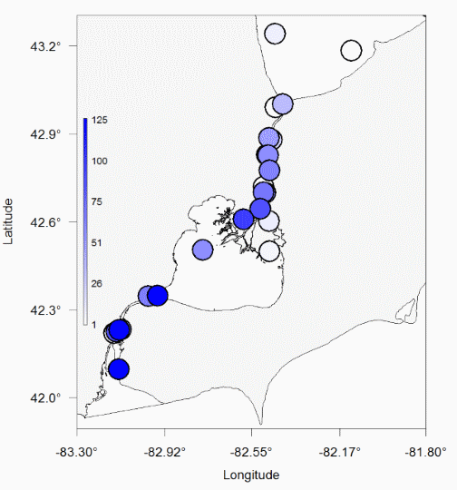

```{r global_options, echo = FALSE,}
options(width = 999)
knitr::opts_chunk$set(echo = FALSE, warning = FALSE, message = TRUE,
                      cache = FALSE, tidy = FALSE, size = "small")
```


```{r include = FALSE}
knitr::opts_chunk$set(echo = FALSE)
library(knitr)

```

# **<span style="color:darkblue">An introduction to <br />  the 'glatos' R package:</span> <br />
 ** <br /> {data-background="rglatos.png"}  

<br />  
<br /> 
<br />

**Chris Holbrook, Tom Binder, Darryl Hondorp, Nancy Nate**  
**Jon Pye, Ryan Gosse, Caitlin Bate** _(Ocean Tracking Network)_  

Annual GLATOS Coordination Meeting  
Feb 27 2020, Ann Arbor, Michigan  


# Why an R package?

<br />

## **Raw Data**  

<div class="fragment" data-fragment-index="1">
Access  
Wrangle  
Check, clean  
Summarize  
Explore  
Analyze  
</div> 

## **Products**


# Why an R package?
 
<br />
<br />

- Consistent (standardization)
- Reproducible
- Efficient
- Accessible
- Transparent

<br />
<br />

Community-driven best practices


# Installing the package  
<br />

## OTN Gitlab

### https://gitlab.oceantrack.org/GreatLakes/glatos


<div class="fragment" data-fragment-index="1">
```{r echo=TRUE, eval = FALSE}
library(remotes)
install_url("https://gitlab.oceantrack.org/GreatLakes/glatos/repository/master/archive.zip",
              build_opts = c("--no-resave-data", "--no-manual"))
``` 

```{r echo=TRUE, include = TRUE}
library(glatos)
``` 
</div>  
<br />
 
 
# A set of tools for:
<br />

## **Data loading**  

- Read project workbook data
- Read detection data
- Read receiver location data
- Read tag specs
    - _Convert 'raw' sensor measurements to 'real' (depth in meters)_

# A set of tools for:
<br />

## **Filtering and summarizing**

- False detection filter
- Compress detections into discrete events
- Simple summaries 
    - _by fish_ 
    - _by receiver/location_ 
- Residence time
- Array evaluation
    

# A set of tools for:
<br />

## **Exploration and visualization**

- Graphical movement histories
- Distribution maps
    - _presence-absence data_
    - _fine-scale positions_
- Animations
    - _interpolating between detections_
    - _making and editing video files_  


# A set of tools for:
<br />

## **Simulation** 

- Code collisions
    - _selecting tag specs_
- Virtual fish in virtual receiver networks
    - _receiver line spacing_
    - _receiver array tradeoffs (grids vs lines)_
 
# {data-background-iframe="https://glatos.glos.us/home/project/HECSL"}
  

# Load Project Workbook data

<div class="fragment" data-fragment-index="1">

```{r echo = 1, results='hide'}
wb <- read_glatos_workbook(wb_file = "HECSL_GLATOS_20170818.xlsm")
```
</div>

<div class="fragment" data-fragment-index="2">
Animals
```{r echo = 0}
head(wb$animals, 3)
```
</div>

<div class="fragment" data-fragment-index="3">

Receivers
```{r echo = 0}
head(wb$receivers, 3)
```
</div>
    
    
# Load Detection data

```{r echo = 1, results='hide'}
det <- read_glatos_detections(det_file = 
                                "HECSL_detectionsWithLocs_20171207_181625.csv")
time_dur = as.POSIXct(c("2016-05-01", "2016-08-01"), tz = "UTC")
det <- det[findInterval(det$detection_timestamp_utc,
                         time_dur) == 1, ]
head(det)
```

<div class="fragment" data-fragment-index="1">

```{r echo = F}
head(det)
```

</div>


# Load Receiver data  
(GLATOS network)

<div class="fragment" data-fragment-index="1">

```{r echo = 1, results='hide'}
recs <- read_glatos_receivers(rec_file = "GLATOS_receiverLocations_20171207_153103.csv")
recs <- recs[!is.na(recs$recover_date_time), ]
recs <- recs[recs$deploy_date_time <= time_dur[2] &
             recs$recover_date_time >= time_dur[1], ]
```

</div>

<div class="fragment" data-fragment-index="2">

```{r echo = F}
head(recs)
```
</div>


# False detection filter  

- Uses **min_lag** 'short interval' criteria  
    - see Pincock 2012 - Vemco technical note

```{r echo = FALSE, result = 'hide', message = FALSE}
det <- false_detections(det, tf = 3600)
```


<div class="fragment" data-fragment-index="1">

```{r}
det <- det[with(det, order(transmitter_id, receiver_sn, detection_timestamp_utc)), ]

det2 <- det[, c("transmitter_id", "receiver_sn", "detection_timestamp_utc", "min_lag", "passed_filter")]

det2[5:10,]
```

</div>

<div class="fragment" data-fragment-index="2">

- Single detections will not pass filter
```{r}
det <- det[with(det, order(transmitter_id, receiver_sn, detection_timestamp_utc)), ]

det2[201:203,]
```

</div>


# False detection filter

```{r echo = 1}
det <- false_detections(det, tf = 3600)
det1 <- det[det$passed_filter == 1, ]
```
<div class="fragment" data-fragment-index="3">


</div>


# Summarize detections by fish

```{r echo = T}
summarize_detections(det1, animals = wb$animals, receiver_locs = recs)
```


# Summarize detections by location

```{r echo = T}
summarize_detections(det1, animals = wb$animals, receiver_locs = recs, summ_type = "location")
```


# Define detection "events"

```{r echo = 1}
det_events <- detection_events(det1, time_sep=3600, condense=FALSE)
## The event filter distilled 7087 detections down to 167 distinct detection events.
# View the first 6 rows of the results.
head(det_events)

det_events <- det_events[det_events$arrive == 1 | det_events$depart == 1,]
```

# Compress detections into events

```{r echo = 1}
det_events2 <- detection_events(det1, time_sep=3600, condense=TRUE)
## The event filter distilled 7087 detections down to 167 distinct detection events.
# View the first 6 rows of the results.
head(det_events2)

```

# Individual movement histories

```{r echo = T, eval = FALSE}
locs <- c('DRL', 'FIC', 'DRF', 'GRW', 'GRE', 'BIN', 'DRU','LSC', 'THA', 'JHN','CHN', 'SCL', 'WLW',
          'FWW', 'FWE', 'BLE', 'SCM', 'MGW', 'MGE','STW', 'STE', 'BLK', 'SCU')

abacus_plot(det_events[det_events$animal_id == "2016_041", ],
            location_col='glatos_array',
            locations=locs,
            main="animal_id = 2016_041",
            type = "b", col='darkred', cex = 2)
```

# Individual movement histories


```{r echo = FALSE, eval = T}
locs <- c('DRL', 'FIC', 'DRF', 'GRW', 'GRE', 'BIN', 'DRU','LSC', 'THA', 'JHN','CHN', 'SCL', 'WLW',
          'FWW', 'FWE', 'BLE', 'SCM', 'MGW', 'MGE','STW', 'STE', 'BLK', 'SCU')

abacus_plot(det_events[det_events$animal_id == "2016_041", ],
            location_col='glatos_array',
            locations=locs,
            main="animal_id = 2016_041",
            type = "o", col='darkred', pch = 20, cex = 2)
```

# Distribution maps

```{r echo = F, message = F, results = 'hide'}
library(rgdal)

shp <-"C:/holbrook/projects/HECSL/data/gis/hec_fromDarryl"
ogrListLayers(shp)
hec_poly <- readOGR(shp, layer = "HEC_ExpandedShoreWGS84")
```


```{r echo = TRUE, eval = F, message = F}
detection_bubble_plot(det_events, 
                      background_xlim=c(-83.3, -81.8), 
                      background_ylim=c(42.0, 43.2),
                      col_grad=c('white', 'blue'), 
                      map = hec_poly, 
                      symbol_radius = 3)
```


# Distribution maps   




# Animating tracks  

- interpolate positions between detections (e.g., hourly, around land, etc.)
    - _interpolate_path_
- make set of images (frames)
    - _make_frames_
- stitch images to video
    - _make_video_

# {data-background-video="fasterx.mp4"}


# Residence index

Relative time spent at a location

```{r echo = TRUE, eval = T} 
ri <- residence_index(det_events2, calculation_method = "time_interval",
                      time_interval_size = "1 day")

ri
```

# Residence index

Relative time spent at a location

```{r echo = FALSE, eval = T, fig.width = 5, fig.height = 5} 
rix <- ri[ri$animal_id == "2016_002",]
plot(hec_poly, bg = "lightgrey", col = "white",
   xlim = c(-83.2, -82.2), ylim = c(42,43))
rix$color <- "red"
rix$color[rix$residency_index == 0] <- "grey"
points(mean_latitude ~ mean_longitude, data = rix, pch = 20, col = color, cex = 1 + residency_index*20)
```

# Array evaluation

Receiver efficiency index (REI)

```{r echo = TRUE, eval = TRUE, fig.width = 6, fig.height = 6} 
reix <- REI(detections = det, deployments = recs)
```
```{r echo = FALSE, eval = TRUE, fig.width = 6, fig.height = 6} 
reix$rei <- round(reix$rei, 4)
reix[order(reix$rei, decreasing = TRUE), ]
```


# Simulations - tag collisions

Simulate collisions to estimate  (REI)

```{r echo = TRUE, eval = TRUE, fig.width = 6, fig.height = 6} 
#parameters analagous to Vemco tag, global coding, 60 s nominal delay
foo <- calc_collision_prob(delayRng = c(30, 90), burstDur = 5.12, 
                           maxTags = 50, nTrans = 10000)

foo
```


# Simulations - tag collisions

```{r, out.width = "600px"}
knitr::include_graphics("collision_sims.png")
```


# Simulations for study design

Receiver line spacing

```{r echo = FALSE, eval = TRUE, fig.width = 5, fig.height = 5}
pdrf <- function(dm, b=c(5.5, -1/120)){
p <- 1/(1+exp(-(b[1]+b[2]*dm)))
return(p)
}


plot(pdrf(0:2000),type='l',
ylab='Probability of detecting each coded burst',
xlab='Distance between receiver and transmitter', las = 1)
```


# Simulations for study design 

Receiver line spacing

```{r echo = TRUE, eval = TRUE, fig.width = 5, fig.height = 5}

detsim <- receiver_line_det_sim(rngFun = pdrf, recSpc = rep(1000,4),
                                outerLim = c(500, 500), nsim = 10000)
detsim
```

# Simulations for study design 

Receiver line spacing

```{r echo = FALSE, eval = TRUE, fig.width = 5, fig.height = 5}

detsim <- receiver_line_det_sim(rngFun = pdrf, recSpc = rep(1000,4),
                                outerLim = c(500, 500), nsim = 3,
                                showPlot = TRUE)
```

# Simulations for study design 

Receiver line spacing

```{r echo = FALSE, eval = TRUE, fig.width = 5.5, fig.height = 5.5}
dp <- rep(NA, 6)
# One receiver with 2500 m on each side.
dp[1] <- receiver_line_det_sim(rngFun=pdrf, recSpc=0,
outerLim=c(2500, 2500), nsim=10000)
## [1] 0.3101
# Two receivers with 2500 m between and 1250 m on each end.
dp[2] <- receiver_line_det_sim(rngFun=pdrf, recSpc=2500,
outerLim=c(1250, 1250), nsim=10000)
## [1] 0.5632
# Three receivers with 1667 m in between and 833 m on each end.
dp[3] <- receiver_line_det_sim(rngFun=pdrf, recSpc=rep(1667,2),
outerLim=c(833, 833), nsim=10000)
## [1] 0.8307
# Four receivers with 1250 m in between and 625 m on each end.
dp[4] <- receiver_line_det_sim(rngFun=pdrf, recSpc=rep(1250,3),
outerLim=c(625, 625), nsim=10000)
## [1] 0.9793
# Five receivers with 1000 m in between and 500 m on each end.
dp[5] <- receiver_line_det_sim(rngFun=pdrf, recSpc=rep(1000,4),
outerLim=c(500, 500), nsim=10000)
## [1] 0.9976
# Six receivers with 833 m in between and 417 m on each end.
dp[6] <- receiver_line_det_sim(rngFun=pdrf, recSpc=rep(833,5),
outerLim=c(433, 433), nsim=10000)

plot(1:6, dp, type='o',ylim=c(0,1),
xlab='Number of receivers',
ylab='Proportion of virtual fish detected',
pch=20, las = 1)
```

# Simulations for study design 

Functions to simulate detections on virtual receiver arrays (2D)

- Simulate fish tracks
    - _crw_in_polygon_
- Simulate tag transmissions
    - _transmit_along_path_
- Simulate detection (based on detection range curve)
    - _detect_transmissions_


# Simulations for study design 

```{r, out.width = "900px"}
knitr::include_graphics("grid_sim_example.png")
```

# Workshop materials
<br />
https://ocean-tracking-network.github.io/2020-02-27-glatos-workshop/index.html


